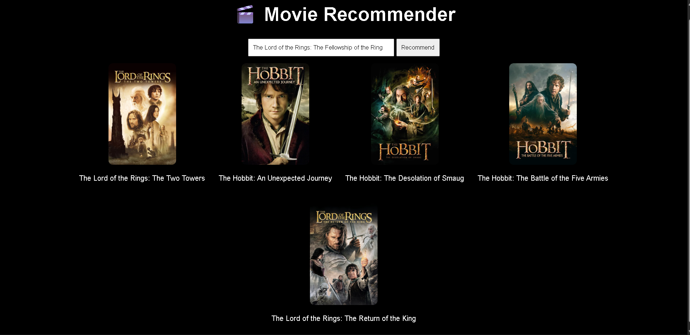
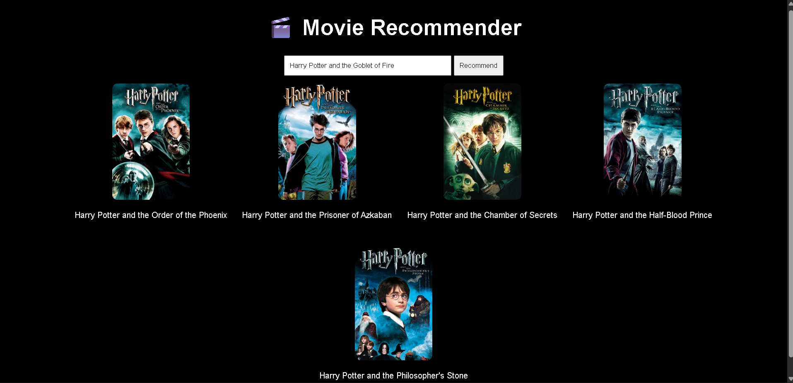

# Movie Recommendation System 🎬

A web-based Movie Recommendation System built with Python, Flask, and Machine Learning. The application suggests 5 similar movies based on your search, and fetches their official posters using the TMDB (The Movie Database) API.

## Previews

### Interface & Recommendations



## Features
- Content-based filtering to recommend movies.
- Fetches real-time movie posters via the TMDB API.
- Clean and responsive web interface.

## Setup Instructions

Follow these steps to run the project locally on your machine:

### 1. Clone the repository
```bash
git clone https://github.com/animesh68/tmdb5000.git
cd tmdb5000
```

### 2. Prepare the Data Models
*Note: Due to GitHub's file size limits, the `similarity.pkl` file (which calculates the distance/similarity between movies) is not included in this repository.*
- Make sure you have the `movies.pkl` and `similarity.pkl` files placed in the root of the project directory.

### 3. Add your TMDB API Key
Open `recommender.py` and replace `"YOUR-API-KEY"` with your actual API key from TMDB.
```python
API_KEY = "your_actual_api_key_here"
```

### 4. Install Dependencies
You need to install the required Python libraries to run this app. Run the following command:
```bash
pip install flask pandas requests
```

### 5. Run the Application
Start the Flask server:
```bash
python app.py
```
Then, open your web browser and go to `http://127.0.0.1:5000` to start searching for movies!
